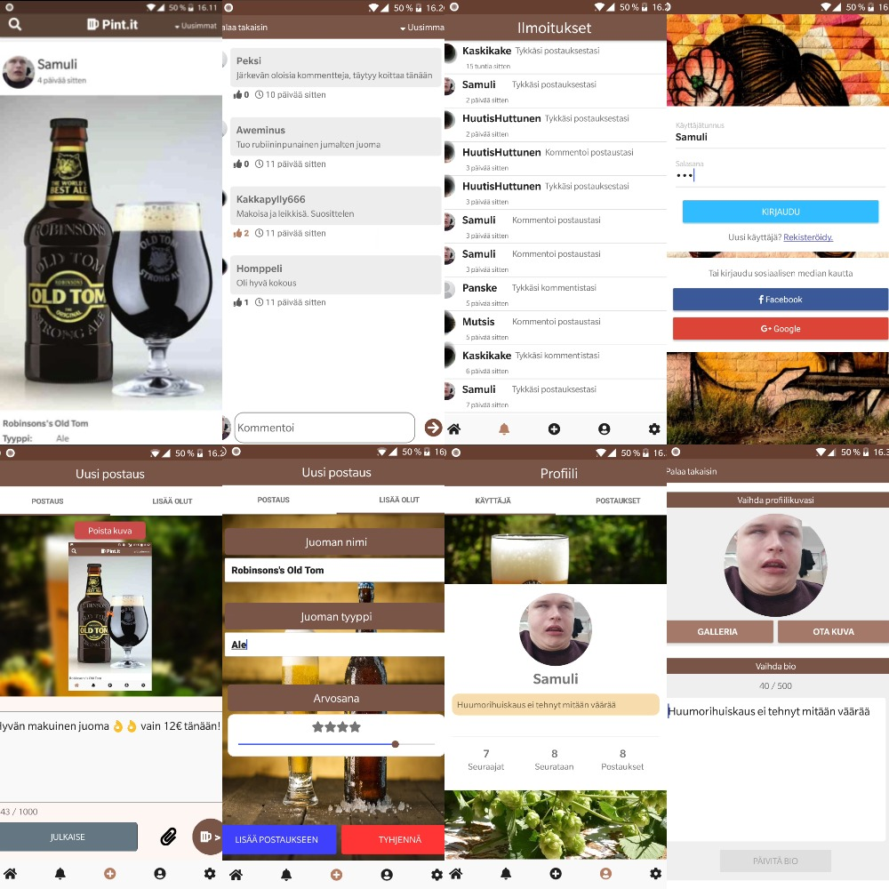

# Pint<span></span>.it

Mobile application revolving around social media and beers
(Not supported for IOS).

## Portfolio
Portfolio which documents the main-parts which I've done while being in Ticorporate **(in finnish)**.
https://samulirukkila.github.io/Pint.it/

## APK

You can find working APK:s for Android in my ```apk/``` folder. APK:s versions
will be construed by their version (1.0, 1.1 etc.).

You can also find the latest APK from [HERE](https://drive.google.com/open?id=1qlXVHNGnDt01NYakWp3wxT3ZI5llAsmM).

## Project

This application was created as a group-project in 5 months time while being in
the Ticorporate-period. I was the main developer in this project so code included
in this repository is around 80% written by me.

The application is meant for people who want's to socialize with other people revolving around beer. In the application you can publish new posts, create and read
other people's comments and follow each and another.

Whole project is in cloud, so you can just download the application and you're ready
to go!

## Technology

Pint<span></span>.it has been created using various technologies, mainly with Javascript.

- **Frontend:**  NativeScript + Angular
- **Backend:** Express + Node.js + Sequelize-framework 
  - Deployed to Heroku
- **Database:** MySQL
  - Deployed to JawsDB
- **Images:** User's profile-pictures, post pictures etc.
  - Deployed to Cloudinary Image-service

# Demo

 

